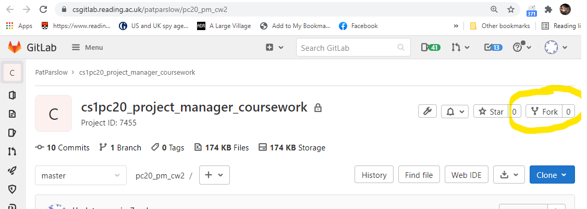

# Coursework 2 Project Planning exercise

Planning is the keystone of successful programming, but it need not all be dry paperwork.  The idea of experimenting with code in a series of feasibility studies can really help identify which approach to take.

In this exercise, you have some thinking to do, and you should get together with others in your peer group (other students) to discuss ideas.

First, though, grab a copy of this project by going to it on CSGitLab and using the "Fork" button near the top right corner.

Please set your version of the project to "private" after forking.

## Goals 

Identify the key goals you need to complete for the coursework

1. File management such as renaming, searching, checking if exists, moving and deleting files.
2. Use of platinuml tool (whatever that tool is 😐)
3. Apparently it has to exclude folders that start with 'a'. Why, you ask? Don't know 🤷‍♂️
4. Diagramming file structure tree and exporting as a graphic (i.e. svg)
5. I would also like to die 😊

## Requirements to fulfill goals

What do you need to be able to meet those goals?  This can include clearer specifications, tests (what needs testing, how to test it?), knowledge etc.

1. Learn file management techniques
2. Learn the function of platinuml
3. What is this?
4. Make/Doxygen/tree command
5. KMS :^)

## Dependencies (mapping goals/requirements etc)

Which requirements relate to which goals - think about drawing out a Product Breakdown for the coursework

1.
1.
1.
1.
1.

_**Hint**_: This might look something like this:

```mermaid
graph LR

    
    Project --> 1_must_haves
    subgraph "Must have"
    1_must_haves --> 1_create_folder_structure
    1_must_haves --> 2_abort_if_exists
    1_must_haves --> 3_initialise_git
    1_must_haves --> 4_feature_management
    end
    
    4_feature_management --> manage_features
    subgraph "manage features"
        manage_features(Manage Features)
        manage_features --> 1_shorthand_codes
        manage_features --> 2_shorthand_lookup
        manage_features --> 3_git_branch_per_feature
    end
 
    Project --> 2_should_haves
    subgraph "Should have"
    2_should_haves --> 5_renaming_features
    2_should_haves --> 6_moving_features
    2_should_haves --> 7_tree_diagram
    2_should_haves --> 8_time_workload_data
    2_should_haves --> 9_time_workload_on_diagram
    end
    
    Project --> 3_could_haves
    Project --> 4_wont_haves
    Project --> readme.md
    

```

## Plan:

### What experimental code can I write now? (feasibility studies)

1. 
1.
1.
1.
1.

_**Hint**_: try modifying the make file created in week4, consider the code in the videos for ideas about automating your code build, and the video on restucturing your project folder, for instance.

### What were the results of trying things out?

1.
1.
1.
1.
1.
